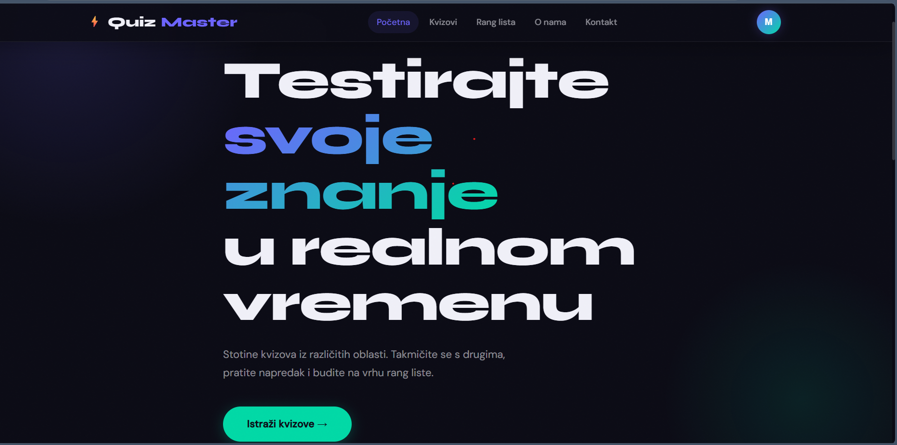
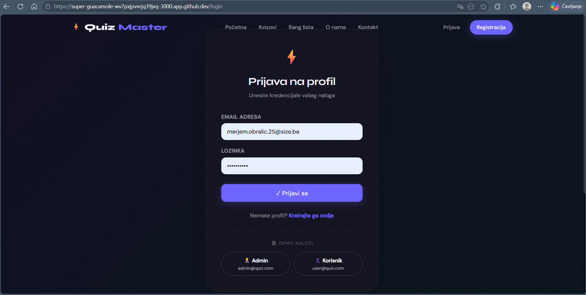
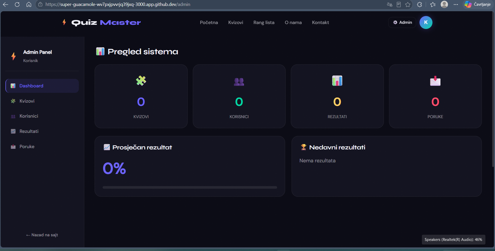
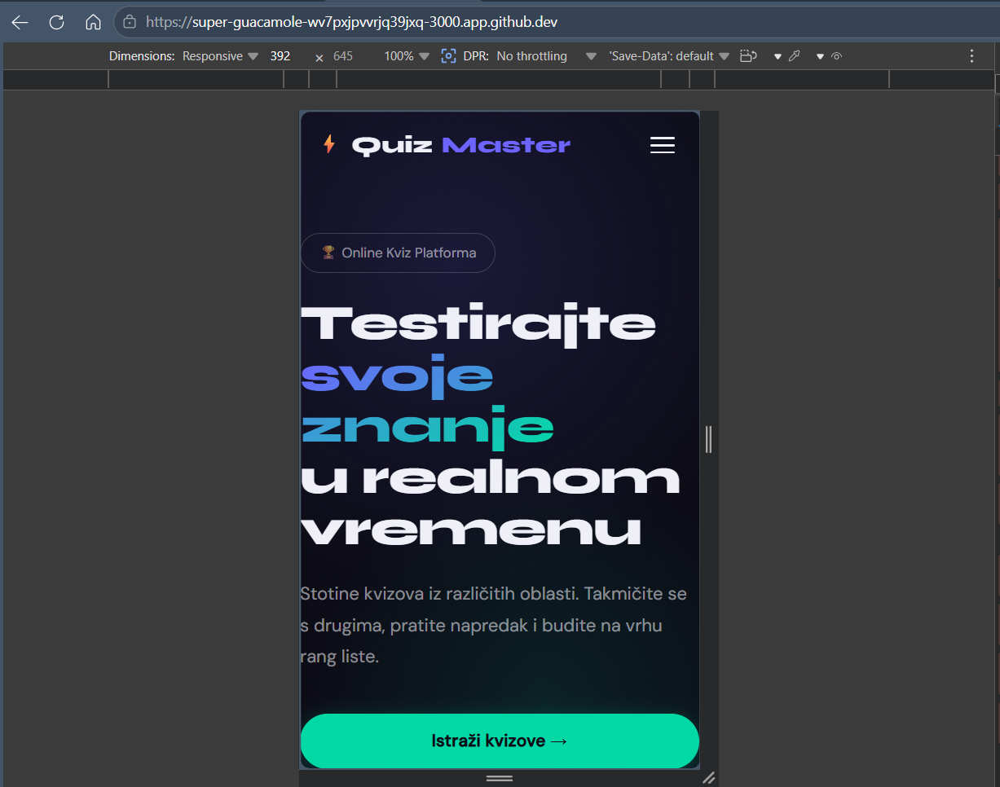

# ⚡ QuizMaster — Online Kviz Platforma

> Studentski projekat — DWS & OSiRuO | Akademska godina 2024/2025

---

## 📝 Opis projekta

**QuizMaster** je full-stack web aplikacija za online testiranje znanja. Korisnici mogu igrati kvizove iz različitih kategorija, pratiti rezultate na rang listi i takmičiti se s drugima. Administratori imaju pristup admin panelu s punim CRUD upravljanjem nad kvizovima, korisnicima i porukama.

Sistem ima implementiranu potpunu autentifikaciju povezanu sa centralnom bazom podataka i pametno rukovanje korisničkim sesijama.

---

## 👥 Tim i doprinos

### Član 1 — Merjem Obralić
* **DWS:** Glavni fajl sa svim putanjama koji spaja sve stranice (`App.js`), početna stranica (`HomePage`), stranica za prijavu (`LoginPage`), stranica za registraciju (`RegisterPage`), Nginx konfiguracija.
* **OSiRuO:** `db.json` baza, postavke za JSON server (`package.json`), Docker konfiguracija za backend (`Dockerfile`), Docker Compose konfiguracija za povezivanje i pokretanje čitavog projekta jednim klikom.

### Član 2 — Adna Salatović
* **DWS:** Sve biblioteke i zavisnosti za React (`package.json`), glavni HTML prozor aplikacije (`index.html`), glavna ulazna tačka za React (`index.js`), globalni CSS sa dizajnom i varijablama (`index.css`), globalno upravljanje prijavom i odjavom korisnika (`Auth`), validacija za email, lozinke i forme (`validators`), lista svih dostupnih kvizova (`QuizzesPage`), igranje kviza sa tajmerom (`QuizPlayPage`), rang lista sa najboljim rezultatima (`LeaderboardPage`), admin panel za upravljanje kvizovima i korisnicima (`AdminPage`).
* **OSiRuO:** Health check skripta, Dockerfile za frontend.

### Član 3 — Adna Hrustanović
* **DWS:** Funkcionalnosti: povlačenje podataka iz baze (`useFetch`), lakše upravljanje formama (`useForm`), tajmer za odbrojavanje vremena tokom kviza (`useTimer`). Glavni meni na vrhu stranice (`Navbar`), podnožje stranice (`Footer`), zaštita koja brani običnim korisnicima ulazak na admin stranice (`PrivateRoute`), "O nama" stranica, kontakt forma sa Google mapom, 404 stranica za nepostojeće linkove.
* **OSiRuO:** GitIgnore postavke, Dockerfile za backend.

---

## 🛠️ Tech Stack

| Tehnologija | Verzija | Svrha |
| :--- | :--- | :--- |
| **React** | 18.2.0 | Frontend framework |
| **React Router** | 6.22.0 | Rutiranje + zaštićene rute |
| **Context API** | React 18 | Globalno stanje autentifikacije i korisnika |
| **react-hot-toast**| 2.4.1 | Toast notifikacije u realnom vremenu |
| **json-server** | 0.17.4 | REST API backend server |
| **Node.js** | 18.x | Lokalno razvojno okruženje |
| **Docker** | 24.x | Kontejnerizacija servisa |
| **Nginx** | alpine | Serviranje produkcijskog frontend-a (SPA) |
| **GitHub Actions** | — | CI/CD automatizacija |
| **GCP Cloud Run** | — | Produkcijski hosting |

---

## 🏗️ Arhitekturni dijagram

┌─────────────────────────────────────────┐│         React SPA (Port 3000/80)        ││                                         ││  AuthContext  │  React Router v6        ││  useFetch     │  PrivateRoute           ││  useForm      │  useTimer               ││                                         ││  Pages:                                 ││  / | /quizzes | /quizzes/:id            ││  /leaderboard | /about | /contact       ││  /login | /register | /admin/* ││  * (404)                                │└──────────────┬──────────────────────────┘│ HTTP REST┌──────────────▼──────────────────────────┐│       json-server (Port 3005)           ││                                         ││  /users   /quizzes   /results           ││  /contacts                              ││                                         ││  db.json (perzistentni podaci baze)     │└─────────────────────────────────────────┘CI/CD: push → main → GitHub Actions→ build Docker images→ push to GCR→ deploy GCP Cloud Run→ health-check
---

## 🎨 Dizajn sistem

### Paleta boja
* `--color-bg`: `#0a0a14` (Glavna tamna pozadina)
* `--color-surface`: `#12121f` (Pozadina kartica i dropdown menija)
* `--color-primary`: `#6c63ff` (Primarne akcije i linkovi)
* `--color-accent`: `#00d9a6` (Uspješne akcije i sekcije)
* `--color-danger`: `#ff4d6d` (Greške, brisanje i odjava)
* `--color-warning`: `#ffd166` (Upozorenja i tajmer)
* `--color-text`: `#f0f0f8` (Glavni čitljivi tekst)

### Fontovi
* **Syne** (400/600/700/800) – Korišten za naslove i logotip.
* **DM Sans** (300/400/500) – Korišten za UI elemente, forme i tekst.

---

## 👤 Korisničke uloge i Autentifikacija

Aplikacija podržava tri nivoa pristupa kroz jedinstven `AuthContext`:

| Uloga | Opseg pristupa i funkcionalnosti |
| :--- | :--- |
| **Admin** | Puni pristup aplikaciji + Admin panel (CRUD nad kvizovima, korisnicima i porukama) |
| **Guest** | Pregled, igranje kvizova i trajno čuvanje rezultata u bazi pod sopstvenim imenom |
| **Neregistrovan**| Samo pregled dostupnih kvizova (Igranje i čuvanje rezultata zahtijeva profil) |

### 🔒 Ključna unaprjeđenja sistema:
1. **Razdvojena Registracija:** Stranica `/register` više ne upisuje podatke u privremeni `localStorage` klijenta, već ih preko API-ja trajno upisuje u centralni `db.json` fajl. Korisnik se kreira bez automatskog logovanja kako bi se izbjegli konflikti stanja na login formi.
2. **Brzi Gost Pristup (One-Click Login):** Na Login stranici implementirano je instant dugme **"Uđite kao Gost"**. Klikom na njega, aplikacija u pozadini automatski vrši brzu prijavu sa sistemskim demo profilom, bez potrebe za manuelnim kucanjem kredencijala.
3. **Pouzdaniji UI/UX u Navbaru:** Izbačen je stari nevidljivi sloj (backdrop) koji je blokirao klikove. Dugme za odjavu prebačeno je sa `onClick` na `onMouseDown` događaj sa visokim prioritetom (`z-index: 999999`), čime je riješen problem zatvaranja dropdown-a prije izvršenja same odjave.

### Demo nalozi (Sistemski)
* **Admin profil:** `admin@quiz.com` | Lozinka: `admin123`
* **Gost profil:** `user@quiz.com` | Lozinka: `user123` *(Dostupan i preko brzog dugmeta)*

---

## 🚀 Lokalno pokretanje i Konfiguracija

### Preduslovi
* Node.js 18+ i npm 9+
* Docker 24+ *(za kontejnerizovano pokretanje)*

### Opcija A — Preko Docker-a (Preporučeno)
Jednim pokretanjem podižu se oba servisa na definisanim portovima:
```bash
git clone [https://github.com/VAS-USERNAME/quizmaster.git](https://github.com/VAS-USERNAME/quizmaster.git)
cd quizmaster
docker-compose up --build
Frontend: http://localhost:3000Backend: http://localhost:3005 (json-server unutar kontejnera)Opcija B — Manuelno (Lokalni razvoj)Pošto AuthContext u aplikaciji pametno mapira i komunicira sa portom 3005 kako bi izbjegao sudaranje sa React portom, server baze pokrenite na sljedeći način:Terminal 1 — Pokretanje baze (Backend)Bashcd backend
npm install
json-server --watch db.json --port 3005
Terminal 2 — Pokretanje aplikacije (Frontend)Bashcd frontend
npm install
npm start
Aplikacija će se automatski otvoriti na http://localhost:3000.Environment varijable (frontend/.env)U slučaju promjene adrese backend-a, kreirajte .env fajl u frontend folderu:Code snippetREACT_APP_API_URL=http://localhost:3005
📁 Struktura repozitorijaquizmaster/
├── frontend/
│   ├── src/
│   │   ├── components/auth/PrivateRoute.js
│   │   ├── components/layout/Navbar.js
│   │   ├── components/layout/Footer.js
│   │   ├── context/AuthContext.js
│   │   ├── hooks/useFetch.js
│   │   ├── hooks/useForm.js
│   │   ├── hooks/useTimer.js
│   │   ├── pages/            # Sadrži LoginPage, RegisterPage, HomePage...
│   │   ├── utils/validators.js
│   │   ├── App.js
│   │   └── index.css
│   ├── public/index.html
│   ├── nginx.conf
│   ├── Dockerfile
│   └── package.json
├── backend/
│   ├── db.json
│   ├── Dockerfile
│   └── package.json
├── docker-compose.yml
├── .github/workflows/deploy.yml
├── scripts/health-check.sh
└── README.md
## 📸 Snimci ekrana radne aplikacije

### 1. Landing stranica


### 2. Prijava i Registracija


### 3. Admin panel


### 4. Mobilni prikaz


### 5. GCP Cloud Run konzola


🔒 Zaštićene ruteRutaPravilo zaštite/admin/*Pristup dozvoljen isključivo korisnicima sa ulogom admin (PrivateRoute adminOnly)/login, /registerPristup dozvoljen samo neulogovanim posjetiocimaSve ostale ruteJavne rute za pregled sadržaja i igranje📸 Snimci ekranaPriloženi snimci ekrana nalaze se u folderu /docs/screenshots/:Prikaz ekranaNaziv fajlaPočetna stranica (Landing page)landing.pngForma za prijavu (Login)login.pngUpravljačka ploča (Admin panel)admin.pngResponzivni prikaz (Mobile menu)mobile.pngGCP Cloud Run konzolagcp.png🌐 Produkcijski URL-oviFrontend aplikacija: https://quizmaster-frontend-XXXX-ew.a.run.appBackend API server: https://quizmaster-backend-XXXX-ew.a.run.app⚙️ GCP Secrets (Potrebno za CI/CD pipeline)Za uspješan deployment preko GitHub Actions-a, u postavkama repozitorija potrebno je definisati sljedeće tajne ključeve:GCP_PROJECT_ID – Identifikator vašeg Google Cloud projekta.GCP_SA_KEY – Autentifikacijski JSON ključ za Service Account sa dozvolama Cloud Run Admin i Storage Admin.